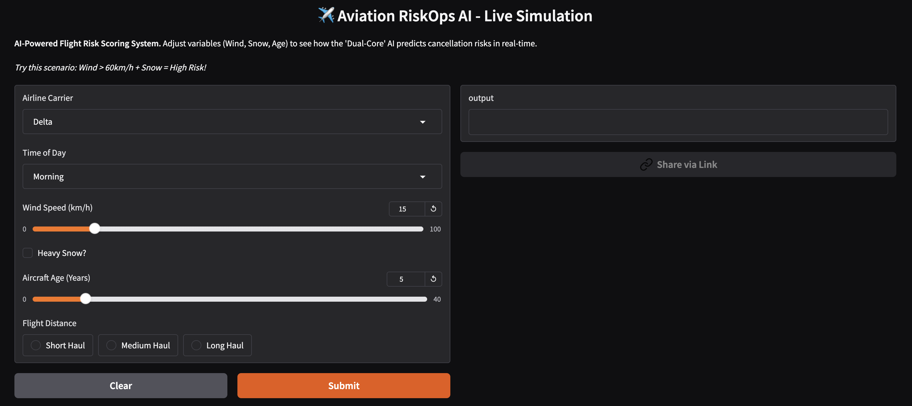
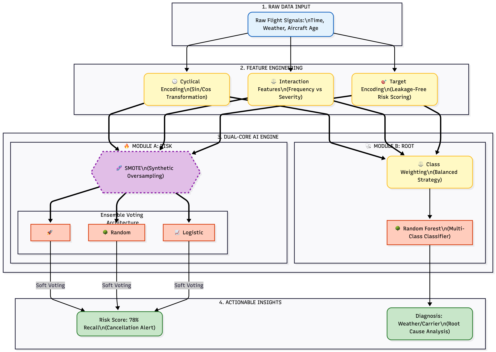

# ✈️ Aviation RiskOps AI: Dual-Core Prediction System
> **Flight Risk Level Scoring & Delay Causality Modeling**
> *(Uçuş Risk Seviyesi Puanlama ve Gecikme Nedensellik Modellemesi)*



### 🚀 LIVE DEMO / CANLI SİMÜLASYON
**[EN]** Test the model directly in your browser without downloading:
**[TR]** Modeli indirmeden tarayıcı üzerinden test etmek için tıklayın:
> **[👉 TRY THE LIVE APP (Hugging Face)](https://huggingface.co/spaces/semaybulut/Aviation-RiskOps-AI)**

---


---

## 📖 Executive Summary (Proje Özeti)

**[EN]**
By analyzing **1.5 GB of U.S. civil aviation data (2023)** and meteorological records, this project aims to minimize **$440 million in annual operational costs**. It employs a **"Dual-Core" AI Architecture** to score flight cancellation risks (0–100) and predict the root causes of potential delays (weather, technical, operational) **before departure**.

**[TR]**
Bu proje, **1.5 GB'lık ABD sivil havacılık verilerini (2023)** ve meteorolojik verileri analiz ederek; uçuş henüz gerçekleşmeden, uçuş iptal risklerini (0-100) puanlar ve olası rötarların kök nedenlerini (hava durumu, teknik, operasyonel vb.) tahmin eder. **"Çift Motorlu" (Dual-Core) Yapay Zeka mimarisi** ile yıllık **440 milyon dolarlık** operasyonel maliyeti minimize etmeyi hedefler.

📄 **Detailed Report / Detaylı Rapor:** [Dashboard & Executive Summary (PDF)](Aviation_RiskOps_Dashboard.pdf)
---

## 🎯 Objectives (Hedefler)

**[EN] Before the flight takes place, this project aims to:**
1.  **Risk Scoring:** Assign a **Risk Score (0–100)** representing the probability of flight cancellation or diversion.
2.  **Root Cause Prediction:** Forecast the root cause of potential delays (e.g., Weather vs. Carrier) prior to operational execution.
3. **Business Intelligence:** Provide interactive dashboards to support airline operational decision-making.

**[TR] Uçuş henüz gerçekleşmeden şunlar hedeflenir:**
1.  **Risk Puanlama:** Uçuşun iptal veya divert olma ihtimalini 0-100 arasında bir Risk Skoru ile puanlamak.
2.  **Kök Neden Tahmini:** Olası bir gecikmenin kök nedenini (Örn: Hava Durumu veya Operasyonel) operasyon başlamadan tahmin etmek.
3.  **Karar Destek:** Operasyon ekiplerine yönelik somut aksiyon önerileri sunmak.

---
## 💾 Data Access: Hybrid Approach (Veri Erişimi)

**[EN]** The project ensures reproducibility while respecting GitHub's storage limits:
* ☁️ **Original Data:** 1.5 GB stored in **Google BigQuery** (Data Warehouse).
* 📂 **Sample Data:** A 50,000-row sample (`aviation_sample_data.csv`) is included in this repo.
> *Note: The notebook is configured to run with this local sample by default (Plug-and-Play).*

**[TR]** Proje, GitHub limitlerine takılmadan tekrarlanabilirliği sağlamak için hibrit bir yapı kullanır:
* ☁️ **Orijinal Veri:** 1.5 GB veri **Google BigQuery** üzerinde tutulmaktadır.
* 📂 **Örnek Veri:** Kodun herkes tarafından çalıştırılabilmesi için 50.000 satırlık bir örneklem (`aviation_sample_data.csv`) repoya eklenmiştir.
> *Not: Kodlar varsayılan olarak GitHub üzerindeki örnek veriyi kullanacak şekilde ayarlanmıştır.*

---
## 🧠 Model Architecture (Model Mimarisi)

**[EN]** The system uses a **"Dual-Core" AI Architecture** to handle complex risks:
**[TR]** Karmaşık riskleri yönetmek için **"Çift Motorlu"** bir Yapay Zeka sistemi kurulmuştur:



1.  **Handling Imbalance (Dengesiz Veri):** Since cancellations are rare (~2%), **SMOTE (Synthetic Minority Over-sampling)** is used to generate synthetic crisis scenarios during training.
2.  **Module A (Risk Prediction):** An **Ensemble (Voting Classifier)** of XGBoost, Random Forest, and Logistic Regression to predict "Will it fly?".
3.  **Module B (Root Cause):** A **Class-Weighted Random Forest** model to diagnose "Why will it delay?".

---

## 🏆 Performance Comparison (Performans ve Sonuçlar)

**[EN]** Comparison of the Baseline (Blind) Model vs. the Final Ultra Model:
**[TR]** Kör uçuş yapan (Baseline) model ile optimize edilmiş (Ultra) modelin karşılaştırması:


| Metric | Baseline Model (Blind) | **Ultra Model (Final)** | Improvement (Etki) |
| :--- | :--- | :--- | :--- |
| **Recall (Cancellation Risk)** | 27% | **78%** | 🚀 **3x Increase (+51%)** |
| **Precision (Risk Alert)** | 18% | **62%** | ✅ **High Reliability** |
| **F1-Score (Macro)** | 0.30 | **0.69** | 📈 **Production Grade** |
| **Weather Root Cause Detection** | 0% | **34%** | 🏆 **New Capability** |
---

## EN: 🛠️ Tech Stack
This project follows a fully integrated, “End-to-End” data science pipeline:
- **Data Storage:** Google BigQuery (Data Warehouse) & Google Drive
- **Compute Environment:** Google Colab (Model Training + GPU)
- **Version Control:** Git & GitHub
- **Modeling:** XGBoost, Random Forest (Python)
- **Libraries:** Pandas, Scikit-learn
- **Data Analysis:** Pandas, SQL (BigQuery), Seaborn
- **Development Environment:** VS Code (Local Development & Git Management)
- **BI & Visualization:** Google Looker Studio

## TR: 🛠️ Tech Stack (Teknolojiler)
Bu projede "End-to-End" bir veri bilimi akışı kurgulanmıştır:
- **Veri Depolama:** Google BigQuery (Data Warehouse) & Google Drive
- **İşlemci:** Google Colab (Model Eğitimi & GPU)
- **Versiyon Kontrol:** Git & GitHub
- **Modelleme:** XGBoost, Random Forest (Python)
- **Kütüphaneler:** Pandas, Scikit-learn,
- **Veri Analizi:** Pandas, SQL (BigQuery), Seaborn
- **Geliştirme Ortamı (IDE):** VS Code (Local Development & Git Management)
- **İş Zekası (BI) & Görselleştirme:** Google Looker Studio
---
## EN: 📂 Folder Structure
- `notebooks/`: Jupyter/Colab notebooks for analysis and modeling (.ipynb)
- `scripts/`: Python scripts for preprocessing and feature engineering at VS Code (.py)
- `data/`:  Local raw datasets *Note: Main datasets are stored in BigQuery*
- `sql_queries`: SQL queries for the mart data tables created in BigQuery for the hypotheses.

## TR: 📂 Klasör Yapısı
- `notebooks/`: Analiz ve modelleme çalışmalarını içeren Jupyter/Colab dosyaları (.ipynb).
- `scripts/`: VS Code ortamında geliştirilen, veri ön işleme ve öznitelik mühendisliği (feature engineering) süreçlerini içeren Python scriptleri (.py).
- `data/`: Yerel (lokal) ham veri setleri. *Not: Ana veri setleri BigQuery üzerinde saklanmaktadır.*
- `sql_queries/`: Hipotez testleri için BigQuery üzerinde oluşturulan özelleşmiş veri tablolarına (Data Marts) ait SQL sorguları.

---
## 🚀 Setup & Run (Kurulum & Kullanım)

**[EN]**
1.  **Clone the repository:**
    ```bash
    git clone [https://github.com/semaybulut/aviation-riskops-ai.git](https://github.com/semaybulut/aviation-riskops-ai.git)
    ```
2.  **Open the Notebook:**
    Navigate to `notebooks/Aviation_RiskOps_Modeling.ipynb`. You can run it via **Jupyter Lab** or upload it to **Google Colab**.
3.  **Run the Demo:**
    The notebook is configured to use the local `aviation_sample_data.csv` by default. **No BigQuery credentials are required!**

**[TR]**
1.  **Repoyu Klonlayın:**
    ```bash
    git clone [https://github.com/semaybulut/aviation-riskops-ai.git](https://github.com/semaybulut/aviation-riskops-ai.git)
    ```
2.  **Notebook'u Açın:**
    `notebooks/Aviation_RiskOps_Modeling.ipynb` dosyasını **Jupyter Lab** ile açın veya **Google Colab**'e yükleyin.
3.  **Demoyu Çalıştırın:**
    Notebook varsayılan olarak yerel `aviation_sample_data.csv` dosyasını kullanacak şekilde ayarlanmıştır. **BigQuery şifresine/yetkisine gerek yoktur!**
    ---
    ### 📬 Contact / İletişim

**SEMA BULUT** - Data Scientist

[](https://www.linkedin.com/in/semaybulut/)
[](https://github.com/semaybulut)
[](semaybulut@gmail.com)

> *Open for collaboration on Data Science & AI projects.*
> *(Veri Bilimi ve Yapay Zeka projelerinde işbirliğine açığım.)*